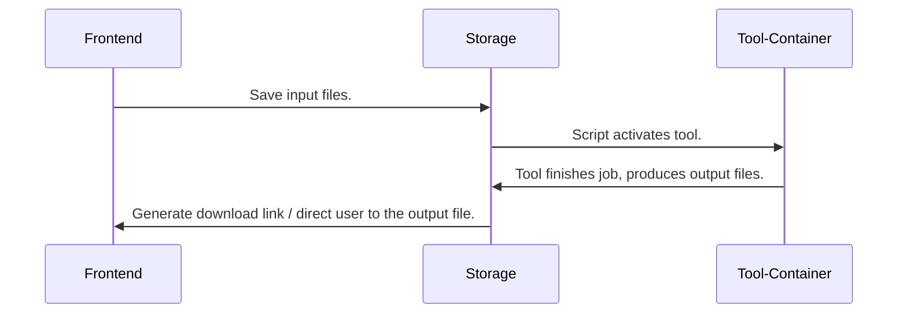

**Frontend**: HTML/JS/CSS supported simple interface
**Storage**: Temporary/Permanant space to manage tool-based scripts, inputs, and outputs.
**Tool-Container**: Docker containers that will be hosted on HVP server, directly takes input and outputs from the storage directory.